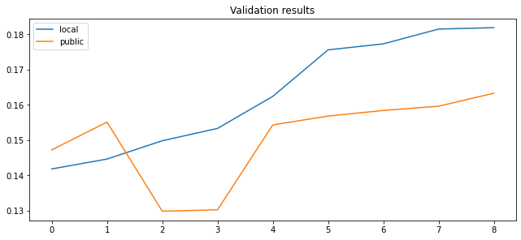

```python
import pandas as pd
```

# Как читать решение

Весь код, для решения задачи предоставлен в файлах 


1_feature_making.ipynb  - формирование 3 фичей из выборок для разных периодов

2_preranking_fit.ipynb - обучение предварительного ранкера

3_ranking_fit.ipynb - обучение основного ранкера (hyperopt не вошел)

4_validate.ipynb - проверка качества решения на 10% данных

5_predict.ipynb - предсказание для тестовой выборки в формате организаторов

К сожалению, если вы не участвовали в соревновании, то сами выборки получить не получится.


В некоторые моменты может потребоваться до 128 Gb RAM. 
При желании думаю, что можно поместиться и в 64 Gb, но потребуется оптимизация.


## В данном файле решение будет представлено схематично.  
При возникновении вопросов можно детальнее посмотреть в любом из настоящих файлов (см выше).

# Описание задачи

В задаче необходимо было подобрать для каждого из 200 тысяч пользователей 20 лучших рекомендованных постов (из 100 тысяч постов), исключая уже просмотренные.
Фактически требовалось найти посты с наибольшим временем просмотра (просмотренный со временем 0 не считался положительным)

Данные в train были отсортированы по времени (хотя временный промежутки и не были указаны).
Я выбрал период предсказания в 5 млн последних записей в файле train_df и назвать это target_df

Так же решил обучаться только на тех пользователях, которые просматривали посты в этот период (target_df.user_id.unique())


```python
full_df = pd.read_parquet('train.parquet.gzip')
train_df = full_df.iloc[:-5000000].reset_index(drop=True)
target_df = full_df.iloc[-5000000:].reset_index(drop=True)

print(train_df.shape)
print(target_df.user_id.nunique())
print(target_df.item_id.nunique())
```

    (139440015, 4)
    482302
    148683


Если бы мы могли решать задачу как классическое ранжирование, то обучающая выборка составила бы несколько десятков миллиардов записей (для каждого user_id выбрать все доступные item_id) и проставить этим записям timespent.

Такими мощностями я не обдадал, поэтому решил как-то уменьшить эту обучающую выборку не сильно уменьшив recall.


# Лучшие item_id

Самая простая идея - взять наиболее "популярные" item_id. Которые посмотрело и много пользователей и крупные timespent. 
Это достигается простым суммированием, правда лучшее решение брать не общую сумму, а допустим за последние 5млн записей

Далее сделаем dataframe со всеми user_id и этими лучшими item_id
Recall такого подбора составил менее 10% для 72 млн записей.


```python

# train_df.iloc[-5000000:].groupby('item_id')['timespent'].sum().sort_values(0, ascending = False).head(150)
best_150_df = pd.read_parquet('/srv/data/vk/train/best_150_df.parquet.gzip')
print(best_150_df.shape)
best_150_df.head()
```

    (72345300, 2)


<div>
<style scoped>
    .dataframe tbody tr th:only-of-type {
        vertical-align: middle;
    }

    .dataframe tbody tr th {
        vertical-align: top;
    }

    .dataframe thead th {
        text-align: right;
    }
</style>
<table border="1" class="dataframe">
  <thead>
    <tr style="text-align: right;">
      <th></th>
      <th>user_id</th>
      <th>item_id</th>
    </tr>
  </thead>
  <tbody>
    <tr>
      <th>0</th>
      <td>594204</td>
      <td>84951</td>
    </tr>
    <tr>
      <th>1</th>
      <td>786182</td>
      <td>84951</td>
    </tr>
    <tr>
      <th>2</th>
      <td>211859</td>
      <td>84951</td>
    </tr>
    <tr>
      <th>3</th>
      <td>222729</td>
      <td>84951</td>
    </tr>
    <tr>
      <th>4</th>
      <td>511856</td>
      <td>84951</td>
    </tr>
  </tbody>
</table>
</div>


```python
count_positive_all = target_df[target_df['timespent']>0].shape[0]
count_positive_best150 = best_150_df.merge(target_df[target_df['timespent']>0])[
    ['user_id','item_id']].drop_duplicates().shape[0]
recall = count_positive_best150/count_positive_all
print(f'recall best items = {100*recall:.1f} %')
```

    recall best items = 9.5 %


# ALS

какую бы гениальную систему рекомендаций мы не придумали - на исторических данных у рекомендательной системы, которая используется на бою будет преимущество (так как пользователь будет видеть рекомендации в ленте и хотя бы иногда изучать их).

поэтому, не смотря на то, что timespent = 0 не дает никаких преимуществ, хотелось бы сохранить какой-то бонус за их просмотр. Самое простое решение -  сделать таргет timespent+1

Небольшой тюнинг показал, что чем больше factors - тем лучше

Recall на 48 млн записей составил уже 25%


```python
#user_item_rating_csr = sparse.coo_matrix((self.train_df["timespent"]+1,
#                                         (user_index, item_index)), shape=shape).tocsr()

feature_als_df = pd.read_parquet('/srv/data/vk/train/feature_als_512_15_df.parquet.gzip')
print(feature_als_df.shape)
feature_als_df.head()

count_positive_all = target_df[target_df['timespent']>0].shape[0]
count_positive_als = feature_als_df.merge(target_df[target_df['timespent']>0])[
    ['user_id','item_id']].drop_duplicates().shape[0]
recall = count_positive_als/count_positive_all
print(f'recall als 512 = {100*recall:.1f} %')
```

    (48195800, 3)
    recall als 512 = 25.1 %


# Использование векторов  для  item_id

Так как нам дали некие embedding вектора для каждого item_id, то стоит их попробовать использовать.

## Вариант 1:

    обучить als зафиксировав item_vectors на данных в качестве embedding


```python
feature_emb_als_df = pd.read_parquet('/srv/data/vk/train/feature_emb_als_df.parquet.gzip')
print(feature_emb_als_df.shape)
feature_emb_als_df.head()

count_positive_all = target_df[target_df['timespent']>0].shape[0]
count_positive_als = feature_emb_als_df.merge(target_df[target_df['timespent']>0])[
    ['user_id','item_id']].drop_duplicates().shape[0]
recall = count_positive_als/count_positive_all
print(f'recall embedding als = {100*recall:.1f} %')
```

    (9639160, 3)
    recall embedding als = 2.1 %


## Вариант 2:

    обучить als зафиксировав item_vectors вначале, а потом "освободив"


```python
feature_emb_als_tune_df = pd.read_parquet('/srv/data/vk/train/feature_emb_als_df_3_3.parquet.gzip')
print(feature_emb_als_tune_df.shape)
feature_emb_als_tune_df.head()

count_positive_all = target_df[target_df['timespent']>0].shape[0]
count_positive_als = feature_emb_als_tune_df.merge(target_df[target_df['timespent']>0])[
    ['user_id','item_id']].drop_duplicates().shape[0]
recall = count_positive_als/count_positive_all
print(f'recall embedding tune als = {100*recall:.1f} %')
```

    (48195800, 3)
    recall embedding tune als = 23.0 %


## Вариант 3:

    Использовать идею - посмотрел один пост, может посмотрит и похожий по cosine_similarity


```python
feature_item_emb_cosine_df = pd.read_parquet('/srv/data/vk/train/feature_item_emb_cosine_df.parquet.gzip')

print(feature_item_emb_cosine_df.shape)

count_positive_all = target_df[target_df['timespent']>0].shape[0]
count_positive_als = feature_item_emb_cosine_df.merge(target_df[target_df['timespent']>0])[
    ['user_id','item_id']].drop_duplicates().shape[0]
recall = count_positive_als/count_positive_all
print(f'recall cosine embedding = {100*recall:.1f} %')
```

    (154837146, 3)
    recall cosine embedding = 13.6 %


# Источник source_id

Так же можно заметить, что user_id часто пользуются одним источником (автором?), поэтому чтобы поднять recall можно отобрать все item_id этого source_id. 
Но, к сожалению, такой подход дает слишком огномное количество кандидатов, поэтому нужно что-то сокращать. 


```python
feature_source_user_df = pd.read_parquet('/srv/data/vk/train/feature_source_user_df.parquet.gzip')
feature_item_df = pd.read_parquet('/srv/data/vk/train/feature_item_df.parquet.gzip')
item_df = pd.read_parquet('items_meta.parquet.gzip')
item_source_dct = item_df.set_index('item_id')['source_id'].to_dict()
feature_item_df['source_id'] = feature_item_df['item_id'].map(item_source_dct)

tmp_df = train_df.iloc[-500000:].copy().reset_index(drop=True)
top_feature_item_df = feature_item_df[feature_item_df['item_id'].isin(
    tmp_df[tmp_df['timespent']>0]['item_id'].unique())]


full_train_item_df = feature_source_user_df[feature_source_user_df['good_sum']>0].merge(
    top_feature_item_df)

print(full_train_item_df.shape)

count_positive_all = target_df[target_df['timespent']>0].shape[0]
count_positive_source = full_train_item_df.merge(target_df[target_df['timespent']>0])[
    ['user_id','item_id']].drop_duplicates().shape[0]
recall = count_positive_source/count_positive_all
print(f'recall source = {100*recall:.1f} %')
```

    (98055044, 14)
    recall source = 21.3 %


# Посчитаем общий recall

Получились неплохие 46% при уменьшении обучающей в 340 раз (!!!)


```python
%%time

input_df = pd.concat([best_150_df[['user_id','item_id']], 
                      full_train_item_df[['user_id','item_id']],
                      feature_als_df[['user_id','item_id']],
                      feature_emb_als_tune_df[['user_id','item_id']],
                      feature_emb_als_df[['user_id','item_id']],
                      feature_item_emb_cosine_df[['user_id','item_id']]]).drop_duplicates().reset_index(drop=True)

count_positive_all = target_df[target_df['timespent']>0].shape[0]
count_positive_union = input_df.merge(target_df[target_df['timespent']>0])[
    ['user_id','item_id']].drop_duplicates().shape[0]
recall = count_positive_union/count_positive_all
print(f'recall union = {100*recall:.1f} %')
```

    recall union = 46.3 %
    CPU times: user 2min 39s, sys: 13.7 s, total: 2min 53s
    Wall time: 2min 53s


```python
(input_df.user_id.nunique()*input_df.item_id.nunique())/input_df.shape[0]

```


    339.30358772572555


# Обогащение фичами

Можно собрать общие статистики на item_id, на source_id, на пару source_id-user_id.
Почему-то я не собрал ни одной статистики на user_id (скорее всего тоже могло помочь)
В итоге получаем обычную обучающую выборку для ранкинга.

Правда строк около 360 млн записей.
А если откатиться еще на один период назад для стабильности - получится еще 360 млн.


```python
sample_result_df = pd.read_parquet('/srv/data/vk/train/result_df_0.parquet.gzip')
sample_result_df.sample(5)
```


<div>
<style scoped>
    .dataframe tbody tr th:only-of-type {
        vertical-align: middle;
    }

    .dataframe tbody tr th {
        vertical-align: top;
    }

    .dataframe thead th {
        text-align: right;
    }
</style>
<table border="1" class="dataframe">
  <thead>
    <tr style="text-align: right;">
      <th></th>
      <th>user_id</th>
      <th>item_id</th>
      <th>source_id</th>
      <th>cnt_users_by_item</th>
      <th>mean_time_by_item</th>
      <th>mean_good_by_item</th>
      <th>mean_abs_react_by_item</th>
      <th>pretarget_time_sum_5m</th>
      <th>pretarget_time_sum_1m</th>
      <th>pretarget_good_sum_5m</th>
      <th>...</th>
      <th>reaction_mean</th>
      <th>reaction_abs_mean</th>
      <th>reaction_abs_sum</th>
      <th>als_score</th>
      <th>emb_als_score</th>
      <th>emb_als_score_tune</th>
      <th>cosine</th>
      <th>source_good_mean</th>
      <th>source_good_sum</th>
      <th>timespent</th>
    </tr>
  </thead>
  <tbody>
    <tr>
      <th>6814235</th>
      <td>241801</td>
      <td>20660</td>
      <td>18665</td>
      <td>1030</td>
      <td>0.295146</td>
      <td>0.202913</td>
      <td>0.005825</td>
      <td>34.0</td>
      <td>6.0</td>
      <td>20.0</td>
      <td>...</td>
      <td>0.0</td>
      <td>0.0</td>
      <td>0.0</td>
      <td>0.000000</td>
      <td>0.000000</td>
      <td>0.0</td>
      <td>0.908238</td>
      <td>0.232897</td>
      <td>160.0</td>
      <td>0.0</td>
    </tr>
    <tr>
      <th>20396138</th>
      <td>725931</td>
      <td>18290</td>
      <td>3832</td>
      <td>21752</td>
      <td>1.490484</td>
      <td>0.282181</td>
      <td>0.017286</td>
      <td>3679.0</td>
      <td>814.0</td>
      <td>704.0</td>
      <td>...</td>
      <td>0.0</td>
      <td>0.0</td>
      <td>0.0</td>
      <td>0.100217</td>
      <td>0.000000</td>
      <td>0.0</td>
      <td>0.000000</td>
      <td>0.320166</td>
      <td>154.0</td>
      <td>0.0</td>
    </tr>
    <tr>
      <th>14211418</th>
      <td>504548</td>
      <td>1042</td>
      <td>7035</td>
      <td>3569</td>
      <td>0.528439</td>
      <td>0.365088</td>
      <td>0.055758</td>
      <td>1886.0</td>
      <td>343.0</td>
      <td>1303.0</td>
      <td>...</td>
      <td>0.0</td>
      <td>0.0</td>
      <td>0.0</td>
      <td>0.000000</td>
      <td>0.000000</td>
      <td>0.0</td>
      <td>0.000000</td>
      <td>0.336213</td>
      <td>506.0</td>
      <td>0.0</td>
    </tr>
    <tr>
      <th>581306</th>
      <td>20104</td>
      <td>179033</td>
      <td>18753</td>
      <td>730</td>
      <td>0.386301</td>
      <td>0.097260</td>
      <td>0.001370</td>
      <td>4.0</td>
      <td>4.0</td>
      <td>1.0</td>
      <td>...</td>
      <td>0.0</td>
      <td>0.0</td>
      <td>0.0</td>
      <td>0.000000</td>
      <td>0.000000</td>
      <td>0.0</td>
      <td>0.000000</td>
      <td>0.192825</td>
      <td>86.0</td>
      <td>0.0</td>
    </tr>
    <tr>
      <th>12417664</th>
      <td>442238</td>
      <td>145417</td>
      <td>20248</td>
      <td>3655</td>
      <td>2.157045</td>
      <td>0.307798</td>
      <td>0.002462</td>
      <td>762.0</td>
      <td>117.0</td>
      <td>113.0</td>
      <td>...</td>
      <td>0.0</td>
      <td>0.0</td>
      <td>0.0</td>
      <td>0.000000</td>
      <td>0.007526</td>
      <td>0.0</td>
      <td>0.000000</td>
      <td>0.301887</td>
      <td>16.0</td>
      <td>0.0</td>
    </tr>
  </tbody>
</table>
<p>5 rows × 26 columns</p>
</div>


```python
#Фичи:
features_desctiptions_dct = {
    'cnt_users_by_item':'Количество users, просмотревших этот item_id',
    'mean_time_by_item':'Среднее время просмотра этого item_id', 
    'mean_good_by_item':'Как часто время было > 0 у этого item_id', 
    'mean_abs_react_by_item':'Средняя реакция (лайк/дизлайк) у этого item_id', 
    'pretarget_time_sum_5m':'Сумма timespent для этого item_id за последние 5млн записей в train', 
    'pretarget_time_sum_1m':'Сумма timespent для этого item_id за последние 1млн записей в train',
    'pretarget_good_sum_5m':'Количество положительных timespent для этого item_id за последние 5млн записей в train', 
    'pretarget_good_sum_1m':'Количество положительных timespent для этого item_id за последние 1млн записей в train',  
    'pretarget_prc':'Соотношение последнего 1 млн записей и 5 млн записей (отражает динамику)',
    'cnt_items': 'Количество item_id, просмотренных user_id у этого source_id', 
    'time_sum':'Количество времени, потраченного user_id у этого source_id', 
    'good_mean':'% положительных timespent в просмотренных item_id этого source_id для конкретного user_id', 
    'good_sum':'количество положительных timespent в просмотренных item_id этого source_id для конкретного user_id', 
    'reaction_mean':'средняя оценка (лайк/дизлайк/0) в просмотренных item_id этого source_id для конкретного user_id',
    'reaction_abs_mean':'среднее наличие оценки (лайк/дизлайк) в просмотренных item_id этого source_id для конкретного user_id', 
    'reaction_abs_sum':'количество оценок (лайк/дизлайк) в просмотренных item_id этого source_id для конкретного user_id', 
    'als_score':'score обычного als', 
    'emb_als_score':'score als на embedding векторах', 
    'emb_als_score_tune':'score als на tuned embedding векторах', 
    'cosine':'лучшая косинусная мера близости с уже просмотренными item_id для каждого user_id', 
    'source_good_mean':'Процент положительных timespent для этого source_id',
    'source_good_sum':'Количество положительных timespent для этого source_id'
}
```

# Идея предварительного ранкинга

Давайте построим простой ранкер (не переобученный) для предварительной разметки и обучим его на 20% выборки (чтобы влезло в оперативку)


```python
result_df = result_df.sort_values('user_id').reset_index(drop=True)
group_pretrain = result_df.groupby('user_id').size().reset_index(name='cnt').cnt.values

ranker_model = lgb.LGBMRanker(n_estimators = 20,
                         random_state = 33,
                         n_jobs = 8
                         )
ranker_model.fit(result_df[study_cols], 
          result_df['timespent'], 
          group=group_pretrain
         )
```

# Основной ранкинг

Будем идти пачками по 10% от всей выборки, подавать на вход предварительному ранкингу и оставлять только лучшие 200 item_id для каждого user_id. Это позволит сократить выборку почти в 3 раза.

Будем строить его на 70% выборки, которые по объему будут уже влезать в оперативную память.

Этот ранкер уже обучим хорошо (подберем параметры по hyperopt)


```python
result_df = result_df.sort_values('user_id').reset_index(drop=True)
group_train = result_df.groupby('user_id').size().reset_index(name='cnt').cnt.values

ranker_full_model = lgb.LGBMRanker(n_estimators = 200,
                         learning_rate = 0.1,
                         random_state = 33,
                         n_jobs = 8,
                         colsample_bytree= 0.844,
                         max_depth= 48,
                         min_child_samples= 1500,
                         min_child_weight=0.00415,
                         min_split_gain= 0.0279,
                         num_leaves= 256,
                         reg_alpha= 0.3605,
                         reg_lambda= 0.4198,
                         subsample= 0.2429)

ranker_full_model.fit(result_df[study_cols], 
          result_df['timespent'], 
          group=group_train
         )
```

# Валидация

 Проверим на оставшихся 10%. 
 Надо понимать, что в нашей выборке изначально recall только 46% и посчитанный ndcg_score только по ней всегда будет выше, чем реальный.
 Для подбора параметров это не важно, но для общей корреляции public и локальной валидации хочется посчитать по всем возможным кандидатам.
 
Определенная корреляция локальной валидации и public leaderbord была, хотя и не очень хорошей: (см ниже)


```python
import matplotlib.pyplot as plt
import numpy as np

valid_df = pd.DataFrame({'local':np.array([1756,1446,1498,1418,1533,1815,1624,1773,1819])/10000,
              'public':np.array([1568,1551,1298,1472,1302,1596,1543,1584,1633])/10000}).sort_values(
    'local').reset_index(drop=True)

fig, ax = plt.subplots(figsize=(8.8, 4), constrained_layout=True)
ax.set(title="Validation results")


ax.plot(valid_df['local'], label = 'local')
ax.plot(valid_df['public'], label = 'public')
ax.legend()
plt.show()
```





# Итоги:

## решение заняло 2 место (0.164 public, 0.163 private, 0.182 local)


## Возможные улучшения:

    1. можно было лучше подбирать параметры под als, как одну из главнейших фич. Были результаты на 0.128 только на als
    2. можно было расчитать als_score для всей обучающей выборки. Правда возрастание кандидатов со 100 до 300 кандидатов не давало сильного прироста
    3. можно было добавить какие-то общие фичи именно для user_id (вряд ли много добавит)
    


```python

```
